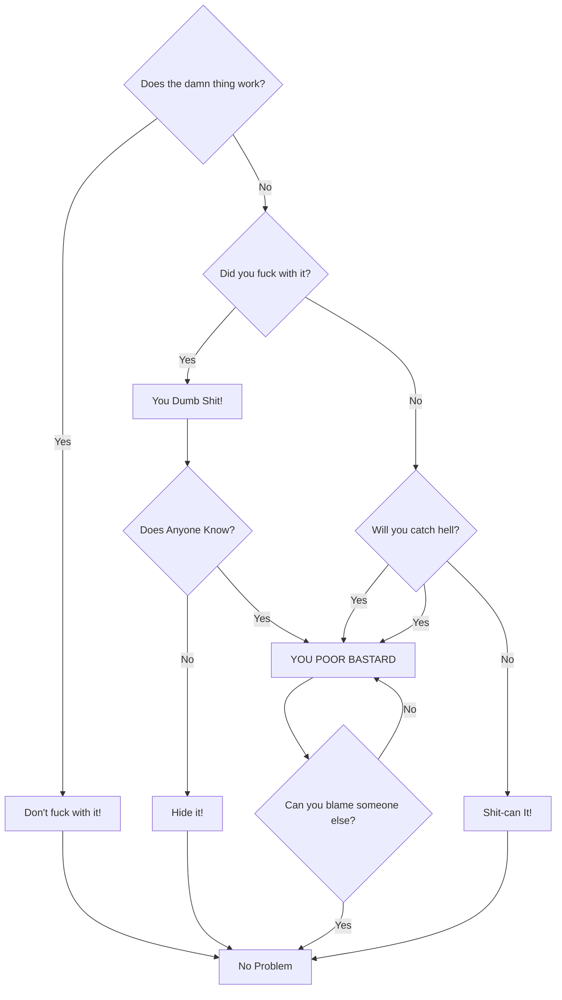

# github-mermaid-testing

```mermaid
flowchart TD
A{Does the damn thing work?}
A --> |Yes| C[Don't fuck with it!] --> Z
A --> |No| D{Did you fuck with it?}
D --> |Yes| E[You Dumb Shit!] --> G{Does Anyone Know?}
D --> |No| F{Will you catch hell?}
G --> |No| H[Hide it!] --> Z[No Problem]
G --> |Yes| P[YOU POOR BASTARD]
F --> |Yes| P
P --> Q{Can you blame someone else?}
Q --> |Yes| Z
Q --> |No| P
F --> |Yes| P
F --> |No| S[Shit-can It!]
S --> Z
```
